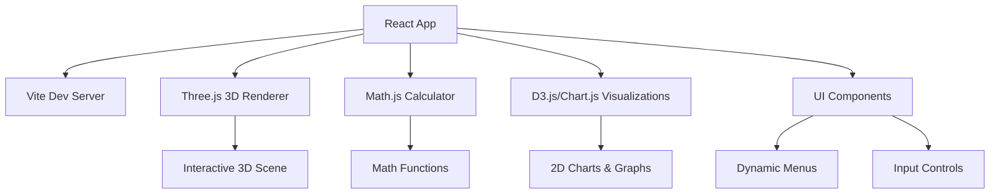

# Proyecto Final de Cálculo Multivariable

## Tecnologías y Librerías
- **Framework Frontend:** React con Vite para desarrollo rápido y moderno
- **Visualización 3D:** Three.js para gráficos 3D interactivos
- **Visualización 2D:** D3.js para gráficos adicionales y Chart.js para visualizaciones matemáticas
- **Cálculos Matemáticos:** Math.js para evaluación de expresiones y cálculos simbólicos
- **Gestión de Dependencias:** npm para paquetes JavaScript
- **Despliegue:** GitHub Pages para hosting gratuito

## Estructura de Vistas
- **Vista Única con Múltiples Menús:** Layout principal con visualizador 3D arriba (proporción 16:9) y paneles de control/menús abajo
- **Panel Superior:** Canvas 3D interactivo para visualización de funciones
- **Panel Inferior:** Menús dinámicos para diferentes funcionalidades (visualización, cálculos, etc.)

## Funcionalidades Matemáticas
- **Visualización de funciones de dos variables:** Gráficos 3D interactivos
- **Cálculo de dominio y rango:** Análisis automático de funciones
- **Derivadas parciales y gradientes:** Cálculo y visualización vectorial
- **Optimización con restricciones:** Implementación de multiplicadores de Lagrange
- **Integración doble/triple:** Cálculo numérico de integrales múltiples

## Arquitectura de la Aplicación

## Diseño y Tema Visual
- **Tema:** Oscuro con elementos neón modernos
- **Fondo:** Negro o gris muy oscuro (#0a0a0a)
- **Grid:** Blanco para alto contraste con glow sutil
- **Color Map 3D:** Gradiente rojizo → verde → azul según valor de la función (reactivo en tiempo real)
- **Estilo:** Neón moderno con efectos de glow, sombras y animaciones CSS/React
- **Layout:** Proporción 16:9 para el visualizador 3D, paneles de control abajo

### Animaciones y Efectos Visuales
- **Transiciones:** Suaves animaciones al cambiar entre menús (0.3s ease-in-out)
- **Glow Effects:** Bordes neón en elementos interactivos (hover/focus states)
- **Color Transitions:** Animación fluida del color map 3D al cambiar funciones
- **Loading States:** Animaciones de carga para cálculos matemáticos complejos
- **Interactive Feedback:** Partículas o efectos al interactuar con la escena 3D
- **Responsive Animations:** Adaptación de efectos según dispositivo (menos intensos en móvil)

### Elementos Visuales Específicos
- **Fondo:** Negro sólido con efectos de luces sutiles en esquinas (morado/azul superior izquierda, inferior derecha)
- **Tipografía:** Fuente moderna sans-serif blanca para títulos y texto principal
- **Título Principal:** "Cálculo Visual Multivariado" en blanco neón
- **Barra de Menús:** Destacada con fondo semi-transparente, letras blancas
- **Menús:**
  - **Menú 1 (Función):** "¿Qué función graficar?" - Texto blanco
  - **Menú 2 (Cálculo):** "Resolver" - Ícono
  - **Otros Menús:** Íconos para parámetros de visualización
- **Footer:** "Proyecto Final de Cálculo Multivariado @2025" en blanco sutil

## Especificaciones Detalladas
### Componentes Principales
1. **Módulo de Visualización:** Manejo de gráficos 3D con Three.js
2. **Módulo de Cálculos:** Lógica matemática con Math.js
3. **Módulo de UI:** Interfaz de usuario responsiva
4. **Módulo de Utilidades:** Funciones auxiliares para validación y formato

### Flujo de Usuario
1. Usuario ingresa función matemática
2. Selecciona tipo de operación (visualización, cálculo, etc.)
3. Aplicación procesa y muestra resultados
4. Usuario puede interactuar con gráficos 3D

### Requisitos Técnicos
- Compatibilidad con navegadores modernos
- Diseño responsivo para móviles y desktop
- Rendimiento óptimo para cálculos complejos
- Validación de entrada de usuario
- Tema oscuro con elementos neón
- Color map reactivo en 3D (rojo-verde-azul)
- Grid blanco de alto contraste
- Layout 16:9 para visualizador 3D

### Funcionalidades Adicionales
- Menús dinámicos en panel inferior
- Interactividad completa en 3D (rotación, zoom, pan)
- Animaciones suaves y efectos neón
- Soporte para expresiones matemáticas complejas
- Visualizaciones 2D complementarias con D3.js/Chart.js